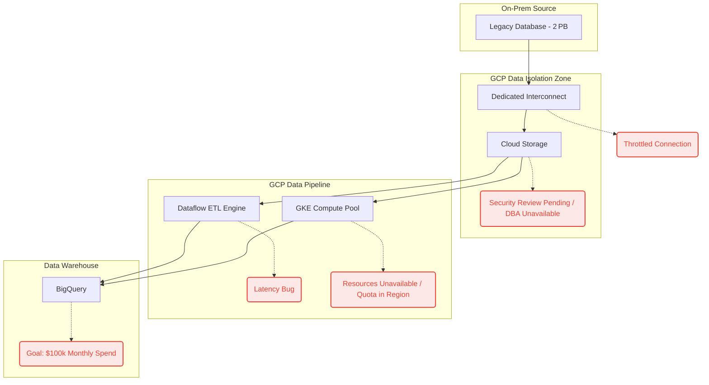

# Slide 1: Title Slide
* **Title:** Path to the $100k Run‑Rate
* **Subtitle:** Delivery Reinforcement & Acceleration Plan
* **Speaker Note:** Goal – transition the stalled 2 PB pipeline into active production.

---

# Slide 2: Executive Summary
**Objective:** Resume the stalled 2PB data migration to realize the anticipated $100k/month consumption target.
**The Interruption:** Revenue ramp is blocked at $5k/month due to network throughput throttling, pending manual DBA security reviews, and localized compute stockouts.
**The Resolution:** A 21-day execution plan leveraging native GCP architecture (VPC Service Controls, ECMP Routing, Regional Clusters) to bypass legacy policy blockers and physical resource limits.
**The Ask:** Executive sponsor alignment to authorize automated security perimeters (VPC-SC) ensuring we clear the regulatory gate immediately.

---

# Slide 3: Current State vs Target State
**Current Velocity**
- **$5k / month** actual consumption.
- **Status:** Stalled by network throttling, missing security clearances, and regional compute stockouts.

**Target Revenue Ramp**
- **$100k / month** anticipated consumption.
- **Status:** Unlock the 2 PB workload, yielding a **$750k** annual run‑rate projection.

---

# Slide 4: Impediments to Revenue Acceleration
1. **2 PB of Raw Data** – massive ingestion volume.
2. **Throttled Interconnect connection** – bandwidth ceiling.
3. **No centralized security on Landing Zone** – lack of perimeter controls.
4. **Security review pending** – compliance gate.
5. **DBA team unavailable** – manual data‑access approvals stalled.
6. **Latency in the data pipeline & processing** – inefficient ETL.
7. **Compute resources unavailable in target region / data center** – quota/stock‑out.

---

# Slide 5: Investigation Hypotheses
*Based on the initial deployment symptom report, the core bottlenecks require validating three specific hypotheses:*

1. **Hypothesis 1 – Networking**
   The Interconnect throttling isn’t a hard physical limit; it is likely a mis‑configured QoS policy or under‑provisioned VLAN attachments capping the BGP session.
2. **Hypothesis 2 – Security / Data Isolation**
   The pending security review is permanently stalled because the DBA is absent. By wrapping Cloud Storage in **VPC Service Controls (VPC‑SC)** we can automatically satisfy InfoSec’s data‑exfiltration concerns without manual DBA review.
3. **Hypothesis 3 – Compute / Pipeline**
   The Dataflow latency bug is an inefficient data‑shuffle phase, and the GKE compute issue is caused by strict zonal pinning that prevents fail‑over to the broader regional compute pool capacity.

---

# Slide 6: Unblocking Strategies (Data & Network)
*Targeted solutions mapping directly to the data volume and throughput constraints:*

- **2PB Ingestion & Throttling:** Implement **ECMP routing** across multiple VLAN attachments to aggregate bandwidth. *Fallback:* Dispatch multiple **Google Transfer Appliances** for offline bulk loading if carrier QoS limits persist.
- **Pipeline Latency:** Enable **Dataflow Streaming Engine / Prime** to offload the pipeline shuffle phase. This instantaneously eliminates worker node memory/CPU bottlenecks causing the inefficiency.

---

# Slide 7: Unblocking Strategies (Security & Compute)
*Targeted solutions to clear regulatory and capacity blockers:*

- **Security Pending & Absent DBA:** Wrap Cloud Storage in a **VPC Service Controls (VPC-SC)** perimeter using **CMEK** encryption. This mathematically guarantees data isolation, proactively satisfying InfoSec and bypassing the manual DBA gate entirely.
- **Regional Compute Stockout:** Pivot pinned single-zone GKE clusters to **Regional Clusters**. This spreads node pools dynamically across zones *a, b,* and *c*, capturing fragmented compute capacity to securely clear the localized stockout.

---

# Slide 8: Stakeholder & Ecosystem Map
*To unblock this workload we need a single “war‑room” with the following players:*

| Entity            | Required Role                                 | Outcome Required                                   |
|-------------------|-----------------------------------------------|----------------------------------------------------|
| **Customer**      | VP of Ops & Head of Cloud Delivery            | Final sign‑off on remediation budget & security waivers |
| **Customer**      | InfoSec Lead                                  | Validate that VPC‑SC perimeter satisfies isolation rules |
| **Integrator**    | Lead Data Engineer (SI)                       | Implement the Dataflow optimizations we mandate   |
| **Google Cloud**  | Outcome CE (you) & Network SME                | Execute interconnect tests & push compute‑quota limits |

---

# Slide 9: The Discovery Framework
*Moving from symptom reporting to concrete root causes:*

- **Network Root Cause** – Run `iPerf` telemetry through the Interconnect using **Network Intelligence Center** to monitor packet drops and TCP windowing.
- **Security Root Cause** – Cross‑reference the InfoSec compliance checklist directly with GCP native controls. Confirm if VPC‑SC addresses the DBA gap.
- **Pipeline Root Cause** – Enable **Dataflow Job Execution Details** UI to chart *Wall Time vs CPU Time*. Identify whether workers are I/O‑bound (network) or CPU‑bound (code inefficiency).

---

# Slide 10: Execution Plan & Governance
### Sequence to Resume $100k/mo Delivery (Timeline Outline)
1. **Days 1‑3** – Execute Technical Discovery Framework & trigger Emergency Stakeholder War Room.
2. **Days 4‑7** – Apply VPC‑SC & DBA Bypass Strategy. Implement Dataflow Shuffle Fix.
3. **Days 7‑10** – Resume 2 PB ETL Workload execution once compute is regionalized.
4. **Days 10‑17** – Validate consumption velocity ($50k/mo initial milestone).

### Governance Strategy
- **Daily 15‑min unblocking stand‑ups** led by the Outcome CE with technical leads.

---

# Slide 11: Post-Resolution Tracking Plan
*Sustaining the $100k/month run-rate requires strict telemetry and governance across time horizons:*

*   **Weekly (Operational Velocity):** Export Cloud Billing data to BigQuery to track actual daily spend vs the $100k target. Delivery of a Velocity Burn-down report to the VP of Ops. Monitor the pipeline error-budget against a negotiated 99.9% SLO.
*   **Monthly (Business Realization):** Executive Business Review (EBR). Review trailing 30-day consumption ($100k achieved) vs the original business case ($750k ARR). Fine-tune Dataflow configurations and lock in Compute Engine Capacity Reservations based on sustained data throughput needs.
*   **Quarterly (Strategic Pivot):** Evaluate the success of the complete 2PB data ingestion. Transition from "Data Migration" to "Data Activation" by introducing Vertex AI / ML use cases on top of the new BigQuery foundation to generate net-new business value.

---

# Slide 12: Questions & Next Steps
*Prompt the two senior stakeholders directly:*

- **VP of Ops:** *Does this sequence and timeline give you confidence in hitting the $750k annual run‑rate without further delays?*
- **Head of Cloud Delivery:** *Are you comfortable signing off on the VPC Service Controls perimeter in place of the delayed manual DBA review?*

---

## Bonus – Mermaid Diagram Code (optional)
### System Bottleneck Architecture Diagram

